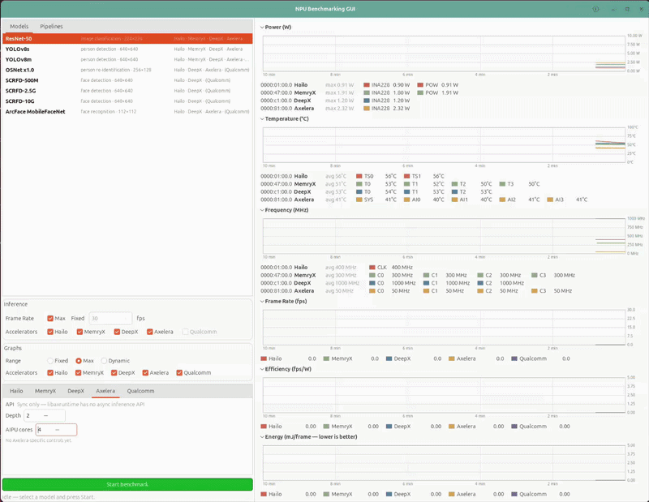

# mb-benchmark-gui

A C++ / GTK4 (gtkmm) desktop GUI that **benchmarks edge-AI NPUs** and charts what
they achieve: frame rate, power, and the two efficiency figures that matter when
comparing accelerators — **fps per watt** and **joules per frame**.

It is the benchmarking companion to [`mb-powermon-gui`](../mb-powermon-gui),
which monitors the same cards' power and temperature. This one adds the load:
it links each vendor's runtime directly and drives inference itself, so the
frame rate on the graph and the watts underneath it come from the same moment on
the same card.



## What it does

Pick a **model** or a **multi-inference pipeline** from the left panel, tick the
accelerators to run it on, choose a target frame rate (or max speed), and press
Start. One worker thread per card loops inference on its own device; the graphs
update once a second.

Six stacked graphs, each a scrolling 10-minute window:

| Graph | What it shows |
| ----- | ------------- |
| **Power (W)** | Live draw per card — on-die sensors and external INA228 shunts. |
| **Temperature (°C)** | Per-sensor die temperatures. |
| **Frequency (MHz)** | Core clock per NPU. Sits right below temperature because a clock sagging while a die heats *is* thermal throttling. Collapsed by default. |
| **Frame Rate (fps)** | Achieved rate per card. An idle card sits at 0. |
| **Efficiency (fps/W)** | *Instantaneous*: this second's frame rate divided by this second's watts. |
| **Energy (mJ/frame)** | This second's watts divided by this second's frame rate — the raw energy cost of a frame. **Lower is better** — the only graph here where that is true. Collapsed by default. |

Power, temperature and frequency come first because they are live whether or not
a benchmark is running; the three below them only mean anything during a run.

**Graphs → Range** decides how every axis responds to its data. All six graphs
share the setting:

| Range | Behaviour |
| ----- | --------- |
| **Fixed** | Leave each axis at its resting top — 100 °C for temperature, a small floor elsewhere. Readings above it clip and draw flat along the top edge. |
| **Max** *(default)* | Start at the resting top, grow to **10 % above the highest reading** once the data reaches it, and never shrink back — so successive runs stay on one comparable scale. |
| **Dynamic** | Track the data at **both ends** — the axis runs from just below the lowest reading to just above the highest, with 10 % of the span as margin. Four dies sitting between 37 °C and 42 °C fill the plot instead of occupying five pixels of a 0–100 axis. The scale moves as the data does, so runs are not comparable by eye. |

**Graphs → Accelerators** picks which cards the graphs show — one checkbox per
card, all ticked by default, any subset selectable. Unticking a card hides both
its **traces and its legend entry**, on all six graphs, so the section shows only
the cards you are looking at.

It is a view filter, not a run filter: every card keeps running and keeps
producing numbers. Two things follow from hiding rather than discarding: the
change applies to the history already on screen, and unticked cards drop out of
the axis calculation, so the ones you kept fill the plot. To choose what actually
*runs*, use the Accelerators checkboxes in the Inference section.

A reading outside **-40…150 °C** is treated as "no reading" and drawn as a gap
rather than plotted. Drivers publish sentinels when a chip stops answering — a
wedged MX3 reports `65262000` millidegrees on every sensor, i.e. -274 °C read as
unsigned — and with no axis clipping any more, one such sample would otherwise
re-scale the temperature graph to ~72000 °C and flatten every real card into the
bottom pixel row.

`Max` is the default because it never clips and never rescales under you. It
matters most on temperature: under `Fixed`, a die past 100 °C draws as a straight
line along the top edge, indistinguishable from one sitting exactly at 100.

All four M.2 cards report a clock, each from a different place. The Qualcomm NSP
does not — its probe is passive thermal only:

| Card | Series | Source | Idle → load |
| ---- | ------ | ------ | ----------- |
| Hailo-8 | `CLK` | `hailo_extended_device_information_t` | 400 (fixed) |
| DeepX M1 | `C0`–`C2` | `dxrt-cli -s`, same line as the temperature | 1000 (fixed) |
| MemryX MX3 | `C0`–`C3` | SDK `get_frequency_effective()` | **300 → 600** |
| Axelera Metis | `C0`–`C3` | `axcmd --clock-all-actual` | **50 → 800** |

Two of them are DVFS-managed and visibly move, which is the point of the graph:
MemryX idles at half its configured 600 MHz, and Axelera's AI cores idle at
50 MHz against a configured 800. For both, use the *actual/effective* reading —
`get_frequency()` and `--get-ck-profile` return the configured target and would
sit flat however hot the part got.

The Axelera trace also exposes something the frame-rate graph cannot: at one
core **only `C0` ramps to 800 MHz while `C1`–`C3` stay at 50 MHz**, i.e. three
of the four AI cores are idle. Raising **AIPU cores** in the Axelera tab wakes them
one at a time — see [Per-accelerator controls](#per-accelerator-controls).

**The graphs are never cleared.** Starting or stopping a run does not wipe the
traces, so consecutive runs stay on one axis and can be read against each other
— change the model or the API mode and the step is visible in place. Idle
stretches sit at zero on all three benchmark graphs. The window is the rolling
10 minutes all six graphs share — long enough to watch a card heat up and
throttle, and to compare several runs side by side without them scrolling off.

`fps/W` and `mJ/frame` are now both raw per-sample figures, which makes them
**exact reciprocals** — the same measurement in two units, not two different
readings. Keep whichever you think in; Energy ships collapsed since Efficiency
already carries the information. Energy is shown in **milli**joules because at
these rates a frame costs on the order of 1–30 mJ, and plain joules would render
as `0.00`.

An idle card reads 0 mJ/frame. On a lower-is-better axis that could be misread
as perfect efficiency — it means "not running", and the frame rate beside it is
0 too.

Every graph uses **one fixed colour per card**, the same everywhere and in the
sibling `mb-powermon-gui`, so a trace is recognisable without reading the legend:

| Hailo | MemryX | DeepX | Axelera | Qualcomm |
| :---: | :----: | :---: | :-----: | :------: |
| Coral `#d9694f` | Sage `#8aa67e` | Slate Blue `#4e7ca1` | Amber `#e0a24b` | Plum `#7e6699` |

Cards appear in the order **Hailo · MemryX · DeepX · Axelera · Qualcomm**
throughout. An external INA228 mapped onto a card inherits that card's colour;
anything else (unmapped bridges, the board ambient sensor) falls back to a
cycling palette.

The legends are a single compact row of swatches and values and carry no
explanatory text; what is running, each card's API mode, whether a run mixes
modes, and any load failure all go to the **status line** under the Start button
— so a card sitting at 0 always has a reason visible somewhere.

## Supported accelerators

| Card | Sync inference | Async inference | Power | Temperature |
| ---- | -------------- | --------------- | ----- | ----------- |
| **Hailo-8** | `InferVStreams::infer()` | `InferModel::run_async()` | firmware `POW` + INA228 | `TS0` / `TS1`, clock `CLK` |
| **DeepX M1** | `InferenceEngine::Run()` | `RunAsync()` / `Wait()` | INA228 (no on-die sensor) | `T0`–`T2`, clock `C0`–`C2` |
| **Axelera Metis** | `axr_run_model_instance()` | **none** — `double_buffer` only | INA228 | `SYS` / `AI0`–`AI3` (needs a live collector), clock `C0`–`C3` |
| **MemryX MX3** | `MxAcclMT::run()` | `MxAccl::connect_stream()` | MemryX SDK + INA228 | `T0`–`T3`, clock `C0`–`C3` |
| **Qualcomm Hexagon NSP** | `QnnGraph_execute()` | **none** — host threads per NSP | **none exists** — see below | `N0-0`–`N1-2` from the TSENS zones, no clock |

The first four are M.2 cards; the fifth is the **SoC-integrated** NPU on a
Qualcomm Dragonwing IQ-9075 EVK (QCS9075, Hexagon HTP v73), so the app builds and
runs on **aarch64** as well as x86_64.

Each backend is **optional and auto-detected at build time**, and the window
adapts to what the build found: a card whose SDK is absent is **not shown at
all** — no checkbox, no settings tab, no legend swatch and no trace — so on a
host with two backends you get a two-card UI rather than three greyed-out
placeholders. Its telemetry still graphs if the hardware is there, since that
comes from sysfs rather than the SDK. The build works on any host.

Greying therefore has exactly one meaning: the card is here, but the selected
model has no artifact for it (hover for which — not downloaded yet, or no build
configured).

### Qualcomm specifics

Three things differ enough from the M.2 cards to be worth stating up front:

- **The artifact is a context binary (`.bin`), and it is a build product of the
  board**, produced by `qnn-context-binary-generator` and locked to that part's
  HTP architecture. There is no URL to download one from, so every `qualcomm`
  entry in `config/models.conf` is `source = local`; drop the files into
  `models/qualcomm/iq9075/`. Loading a cached context costs ~15–25 ms against
  0.6–2.6 s to finalize a graph from scratch, which is why the runner accepts
  nothing else.
- **Concurrency is NSPs.** QCS9075 has two, each with its own 8 MB VTCM, and the
  **NSPs** control (1–2, default 2) claims them. Measured on OSNet x1.0 in
  burst: 1618 fps on one NSP, 3546 on two in Sync; 2313 / 4581 in Async at
  depth 4. Async here is extra engines in flight per NSP on host threads — QNN
  has no async API, and the status line says so.
- **Performance mode is exposed and always reported**, because the HTP runs
  under DCVS and the spread is ~1.8× (burst 3381, `sustained_high_performance`
  2818, balanced 2384, power_saver 1886 on the same model). A Qualcomm frame
  rate without a stated mode is not comparable to anything. Use burst for peak
  figures and `sustained_high_performance` for steady state.

There is **no power measurement on this board** — no INA/shunt monitor in any
IQ-9075 device tree, no hwmon current sensor, and the QNN libraries expose only
the DCVS *mode*, which is a setting rather than a meter. The NSP also shares the
package rail with the CPU and GPU, so even a package figure would not be an NPU
figure. Efficiency and Energy therefore stay at 0 for this card, deliberately:
a fabricated number sitting next to genuine INA228 readings would be worse than
a gap. Wiring an INA23x/INA228 onto an i2c bus and declaring it in a device-tree
overlay is the way to get real watts here.

## Sync API vs Async API

Each card chooses its own API mode, in **its own tab** — there is no run-wide
setting. This is the single biggest lever on the numbers, far bigger than the
model choice, so it is worth understanding what each mode actually drives.

The five SDKs are **not symmetric**, and the UI does not pretend otherwise:

| Card | Sync | Async | Tab shows |
| ---- | ---- | ----- | --------- |
| **Hailo-8** | `InferVStreams::infer()` | `run_async()` + `AsyncInferJob` | Sync / Async radios |
| **DeepX M1** | `InferenceEngine::Run()` | `RunAsync()` → `Wait()` | Sync / Async radios |
| **MemryX MX3** | `MxAcclMT::run()` | `MxAccl::connect_stream()` | Sync / Async radios |
| **Axelera Metis** | `axr_run_model_instance()` | **none exists** | *"Sync only"* |
| **Qualcomm NSP** | `QnnGraph_execute()` | **none exists** | *"Sync only"* |

Cards whose runtime has only one inference API get a static line naming it
rather than radios, so the UI never offers a mode that does not exist. Every
mode the UI *does* offer is backed by a real vendor API — nothing is emulated
any more. (`api_mode_note()` still exists for the emulated case and is exercised
by the headless drivers, which can set any mode on any card; it no longer fires
from the GUI.)

**A run may mix modes**, which is useful (Hailo in Sync beside DeepX in Async)
but is not a like-for-like comparison. The status line flags it: *"Mixed API
modes — these cards are not directly comparable with each other."*

**Async is the default** on every card that offers the choice, because it is
what the hardware can actually do. Axelera and Qualcomm have no choice to make —
they always run their blocking call, with **Depth** as their concurrency knob.

- **Sync** — one frame at a time, waiting for each. What a latency-bound
  real-time pipeline does. Native everywhere: Hailo, DeepX, Axelera, Qualcomm,
  and MemryX via `MxAcclMT` (a *different class* from the streaming `MxAccl` —
  earlier versions of this app wrongly reported MemryX as having no blocking
  call and emulated one).
- **Async** — several frames outstanding. Peak throughput. Native on Hailo
  (`run_async` + `AsyncInferJob`), DeepX (`RunAsync`/`Wait`) and
  MemryX (`connect_stream`, depth from the Depth control). Axelera's runtime
  exposes **no async inference API whatsoever** — 41 `axr_*` entry points,
  exactly one of which is inference, and it blocks — so overlap there comes from
  the runtime's own
  `double_buffer` property, which is a much weaker mechanism.

### Depth

**Depth** is per card, in that card's tab — how many frames it keeps in flight.
Every backend has some form of it, but the mechanism differs and so does the
useful range:

| Card | What depth sets | Range |
| ---- | --------------- | ----- |
| **Hailo-8** | requested async queue depth, capped by HailoRT's own reported queue size | 1–8 |
| **DeepX M1** | outstanding `RunAsync` jobs | 1–8 |
| **MemryX MX3** | `connect_stream` permit depth | 1–8 |
| **Axelera Metis** | `double_buffer` — 2 is the ceiling the API has, see below | 1–2 |
| **Qualcomm NSP** | engines in flight per NSP, one host thread each | 1–8 |

Axelera's 1–2 is the API's own limit, not a chosen one: the runtime logs
*"overriding to depth=2 for double buffering"*, an explicit `depth=4` property is
rejected with `Unknown property key: depth`, and `double_buffer=4` measures the
same as `double_buffer=1`. Anything above 2 would silently be 2.

On a card that offers both API modes, depth greys out in **Sync** — one frame at
a time is what Sync means. On the two cards with no async API (Axelera,
Qualcomm) depth is their *only* concurrency knob besides cores/NSPs, so it stays
live.

Depth buys a lot until the device saturates and nothing after. Measured on
ResNet-50:

| DeepX depth | fps | | Axelera depth | fps |
| ----------: | --: | --- | ----------: | --: |
| 1 | 402.2 | | 1 | 573.7 |
| 4 | **1085.1** | | 2 | **589.6** |
| 8 | 1061.6 | | | |

Measured on this host, max speed:

| YOLOv8s | Sync | Async | |
| ------- | ---: | ----: | --- |
| Hailo-8 | 123.0 | **490.7** | 4.0× |
| DeepX M1 | 32.2 | **148.1** | 4.6× |
| Axelera Metis | 131.2 | 154.3 | 1.2× *(depth 1 → 2)* |

| ResNet-50 | Sync | Async | |
| --------- | ---: | ----: | --- |
| Hailo-8 | 297.3 | **1370.1** | 4.6× |
| DeepX M1 | 392.9 | **1086.7** | 2.8× |
| Axelera Metis | 352.1 | 376.1 | 1.1× *(depth 1 → 2)* |

Two things worth drawing out. DeepX's poor *sync* YOLOv8s figure is an artifact
of the mode, not the card — DXRT is built around its job queue, and in async it
gains 4.6×. And Axelera's small gain is the honest consequence of its API: a
double buffer is not a job queue, and no amount of host threading would make it
one.

**Compare within a mode, never across.** A sync number and an async number are
answers to different questions.

## Per-accelerator controls

Below the `Inference` frame is a tab per card. Every tab leads with the two
controls each card has, then whatever else that device exposes:

- **API** — `Sync` / `Async` radios where the vendor ships both, a static line
  naming the only mode where it does not. See
  [Sync API vs Async API](#sync-api-vs-async-api).
- **Depth** — frames in flight; range and meaning are per card, see
  [Depth](#depth). Greys out on a card running Sync, where the depth is 1 by
  definition.

- **MemryX — Core frequency** (200–850 MHz, default 600). 600 is the 14 TOPS
  mode, 850 the 20 TOPS one. Applied before the run starts. There is no C++
  setter — `set_mpu_frequency` exists only in the Python `mxa` module, absent
  from both `memx.h` and `MxAccl` — so this is a one-shot interpreter call at
  load time, never in the timed loop.
- **Axelera — AIPU cores** (1–4, default 2). How much of the Metis the model
  claims, passed as `num_sub_devices` to `axr_device_connect()`.

> ⚠️ **Do not set this to 4 on this card.** Claiming all four cores makes every
> MSI vector time out and drops the PCIe link, after which the Metis sits in
> bootloader and no firmware upload succeeds until a **full power-off** — a
> driver reload does not clear it. 1–3 run fine; 3 is the highest value seen
> stable. The default is 2 so that a fresh checkout can't cost you a power
> cycle. See [Known issues](#known-issues).

**Cores matter more than anything else on the Metis.** libaxruntime has no async
API, and a model only occupies the cores it asked for — which the Frequency
graph shows directly: on one core `aicore0` runs at 800 MHz while `aicore1`–`3`
sit at 50 MHz. Measured on ResNet-50:

| AIPU cores | fps | AI core clocks |
| ---------: | --: | -------------- |
| 1 | 437 | `800 · 50 · 50 · 50` |
| 2 | 671 | `800 · 50 · 800 · 50` |
| 4 | **805** | `800 · 800 · 800 · 800` |

2.1× from 1 → 4, with the cores waking one at a time. A multi-stage pipeline
divides the card between its stages, so the request is capped at
`subdevice_count / stages`.

A core is lit by a **model instance**, and an instance occupies exactly one core
regardless of what its connection asked for — so *N* cores means *N* connections
with one instance each. Measured on ResNet-50, clocks sampled mid-run:

| connections × instances | aicore0..3 during run | fps |
| --- | --- | --- |
| 1 × 1, asking for 4 cores | `800 · 50 · 50 · 50` | 375.6 |
| 1 × 4 on one connection | collides — `Failed to wait for MSI` | 201.7 |
| **4 × 1** | **`800 · 800 · 800 · 800`** | **694.9** |

Scaling is strongly sublinear — 358.7 / 574.0 / 658.6 / 694.9 fps at 1 / 2 / 3 /
4 cores, i.e. 1.94× for four times the silicon, saturating around three. That is
the card, not the harness.

**On the vendor's multi-core builds.** Axelera's prebuilt zip ships four
compilations of each model (1, 2, 3 and 4 cores); the compiler moves constants
from DDR into L2 as the count rises, from 7.6 MB L2 / 20 MB DDR at one core to
28 MB L2 and no DDR at four. We deliberately use the **1-core** build. Those
builds spread a *single* frame across cores, which lowers latency but costs
throughput: at two cores occupied, the 2-core build managed **317.6 fps** against
**574.0** for two instances of the 1-core build — and it is slower than the
1-core build on a single core. For a throughput benchmark, N independent
instances is the right shape.

The control was previously labelled "Streams" and the core count was *derived*
from it. The mechanism was right but the name hid it, and the first connect on a
cold card was allowed to race the others: every `axr_device_connect()` makes the
runtime reload the card's firmware, so several at once could interrupt the
3.8 MB firmware upload and drop the PCIe link. The first connection is now made
alone and allowed to finish before the rest are opened.

## Models and pipelines

The catalog is **[`config/models.conf`](config/models.conf)** — that file *is*
the Models and Pipelines lists. Adding a model is an edit there, not a rebuild.
Its contents mirror [`envic_ai_cpp`](../envic_ai_cpp)'s pipeline registry, minus
the DeGirum widerface YOLOv8n face detectors, and its download sources are
lifted from the vendor scripts in the sibling project
(`get_hailo8_models.sh`, `get_deepx_models.sh`, `get_axelera_models.sh`).

Entries are **logical** — one row resolves to a different compiled artifact per
vendor (`yolov8s.hef` / `YoloV8S.dxnn` / `yolov8s-coco-onnx`), which is what lets
the same model run on three cards at once and be compared trace against trace.

### Automatic download

Missing artifacts are fetched on first launch into

```
models/<vendor>/<accelerator>/
  hailo/hailo-8      axelera/metis      deepx/dx-m1      memryx/mx3
  qualcomm/iq9075
```

(`qualcomm/iq9075` is never fetched — its context binaries are build products of
the board itself. See **Qualcomm specifics**.)

resolved relative to the binary, so the working directory doesn't matter. It runs
on a background thread — the window opens immediately and each row becomes
selectable the moment its artifact lands; until then the card shows in
parentheses, e.g. `Hailo · (DeepX) · Axelera`. Downloads land in a `.part`
sibling and are renamed on success, so an interrupted fetch never leaves a
truncated file that looks like a valid model.

Each vendor's archives have a different shape, so `fetch` in the config says
which to expect:

| `fetch` | Vendor | Shape |
| ------- | ------ | ----- |
| `file` | Hailo, DeepX | `GET <url>/<artifact>`, saved as-is |
| `zip` | Axelera | `GET <url>/<artifact>.zip`, whose `strip` subtree is flattened into a directory named `<artifact>` |
| `zipfile` | MemryX | `GET <url>/<stem>.zip`, from which only the `<artifact>` member is taken |

MemryX archives also carry a `<name>_post.onnx|tflite` head for host-side YOLO
decode; it is deliberately **not** extracted, since no backend runs
post-processing inside the timed loop.

**The first run pulls roughly 1.5 GB** — the Axelera prebuilt zips dominate
(564 MB for `yolov8s-coco-onnx` alone, extracting to ~113 MB). Set
`MB_BENCH_NO_DOWNLOAD=1` to skip fetching entirely and use only what's on disk.
Needs `wget`, plus `unzip` for the Axelera and MemryX archives.

Two artifacts have **no public source** and are marked `source = local` in the
config; they are never fetched, and are used only if you drop them in yourself:

| Artifact | Why |
| -------- | --- |
| `deepx/dx-m1/osnet.dxnn` | Not in the DeepX ModelZoo — compiled locally with DX-COM (see `ai_deepx/models/osnet/deploy.sh` in the sibling project). Without it, DeepX has no People Tracking pipeline. |
| `axelera/metis/arcface_mobilefacenet--112x112_quant_axelera_metis_1` | The Voyager prebuilt catalog ships `facenet-lfw-onnx`, not ArcFace; this is a custom Voyager compile. |

**Models**

| Model | Task | Hailo | DeepX | Axelera | MemryX | Qualcomm |
| ----- | ---- | :---: | :---: | :-----: | :----: | :------: |
| YOLOv8s | person detection, 640×640 | ✅ | ✅ | ✅ | ✅ | local |
| YOLOv8m | person detection, 640×640 | ✅ | ✅ | ✅ | ✅ | local |
| SCRFD-500M / 2.5G / 10G | face detection, 640×640 | ✅ | ✅ | — | — | local |
| OSNet x1.0 | person re-identification, 256×128 | ✅ | local | ✅ | — | local |
| ArcFace MobileFaceNet | face recognition, 112×112 | ✅ | ✅ | local | — | local |
| ResNet-50 | image classification, 224×224 | ✅ | ✅ | ✅ | ✅ | local |

(✅ = downloaded automatically; *local* = no public source, see below. Every
Qualcomm entry is local by nature — a context binary is a build product of the
board it runs on — and all eight models plus all five pipelines are built.)

**Pipelines** — every stage runs once per benchmark frame, in order, on the same
card:

- **People Tracking** — person detection + OSNet ReID (YOLOv8s or YOLOv8m)
- **Face Recognition** — face detection + ArcFace (SCRFD-500M, 2.5G or 10G)

A row with no artifact configured for a vendor simply isn't offered there; a
pipeline is offered only where *every* stage resolves. Nothing here is fatal —
the lists show what you actually have.

## What is being measured

This matters for reading the numbers honestly.

- **Synthetic input, no host pipeline.** There is no camera, no decode, no
  letterbox, no NMS, no drawing. Each stage gets a fixed pseudo-random buffer of
  the model's native input size, prepared once at load. What is timed is the
  accelerator plus its SDK's inference call — not this host's CPU.
- **No host-side conversion in the loop.** Hailo output vstreams are created with
  `HAILO_FORMAT_TYPE_AUTO` (device-native) rather than FLOAT32, so HailoRT does
  not dequantize on the host inside `infer()`. DeepX outputs stay in the
  engine-owned buffers. Axelera outputs are left in their raw padded device
  layout. All three would otherwise be measuring this CPU.
- **One mode at a time, and one call means one frame.** Whichever API mode is
  selected applies to every card in the run, and an async runner tops its
  pipeline up and then blocks until a frame *completes* — so the engine's frame
  counter means the same thing in both modes. See
  [Sync API vs Async API](#sync-api-vs-async-api) for which vendor is emulated
  in which mode; compare within a mode, never across.
- **Pipeline stages run once per frame.** In a real cascade a recognizer runs
  once per *detected object*; a synthetic benchmark has no detections, so each
  stage counts once. (`BenchMember::reps` exists to lift this without a
  redesign.)
- **One subject per card at a time.** Two models sharing a card would split its
  throughput *and* its watts, and neither efficiency figure would mean anything
  per model. The UI enforces one selection at a time.
- **No watts, no efficiency.** A card with no power reading reports a real frame
  rate but sits at 0 on both efficiency graphs, rather than being given an
  invented number. On this host every card is now instrumented, so this only
  applies to a card whose INA228 is unmapped or absent — DeepX and MemryX have
  no on-die sensor at all and depend entirely on their external shunt.
- **Async depth is 4** on DeepX and MemryX, and whatever HailoRT reports as its
  async queue size (capped at 8) on Hailo — deep enough to keep the NPU fed,
  shallow enough that the figure stays a throughput measurement rather than a
  latency-hiding contest.
- **Axelera core allocation.** The card's sub-devices are split evenly across a
  pipeline's stages (a single model gets them all), falling back to one core per
  stage if a model's deploy-time core cap refuses the wider connection. The
  legend shows what it got.

## How it compares to the vendors' own benchmark tools

ResNet-50, Async mode, steady state, measured on this host — against each
vendor's utility run on the *same* machine where possible:

| Card | Vendor tool | Vendor fps | This app | Ratio |
| ---- | ----------- | ---------: | -------: | ----: |
| **Hailo-8** | `hailortcli benchmark` | 1371.3 | **1372.3** | 100 % |
| **DeepX M1** | `dxbenchmark` | ~1009–1070 | **1080.3** | ~101–107 % |
| **MemryX MX3** | `mx_bench -f 50000` | 1795.9 | **1115.8** | 62 % |
| **Axelera Metis** | `inference.py … --aipu-cores 4` (4 streams) | 2054 | **380.3** | 18 % |

Hailo and DeepX land at parity, which is the result that matters most: it says
the async path, the frame accounting and the "one call retires one frame"
contract are all sound. The two shortfalls are both understood, and both are
concurrency, not the device:

- **Axelera — 18 %.** The vendor figure comes from the Voyager *pipeline*
  running **four parallel video streams** with OpenCL preprocessing across 4
  AIPU cores. This app issues a single blocking `axr_run_model_instance` on one
  model instance. Since libaxruntime exposes no async inference API at all, the
  only way to express that concurrency is N model instances driven from N host
  threads — which this app does not (yet) do. Note the comparison is unfair *in
  our favour* on scope — their 2054 fps is end-to-end including video decode,
  ours is inference-only — so the whole gap is parallelism.
- **MemryX — 62 %.** One stream with 4 frames in flight, where `mx_bench`
  drives more. Corroborated by the power: 7.6 W against the vendor run's 11.0 W,
  i.e. the device is not being saturated. More `connect_stream` ids and/or
  `set_num_workers` should close it.

Efficiency, same runs:

| Card | This app | Vendor run |
| ---- | -------: | ---------: |
| Hailo-8 | 321.4 fps/W @ 4.27 W | 343 fps/W @ 4.0 W |
| DeepX M1 | 203.5 fps/W @ 5.30 W | 214 fps/W @ 4.7 W |
| MemryX MX3 | 148.2 fps/W @ 7.49 W | 163 fps/W @ 11.0 W |
| Axelera Metis | 104.2 fps/W @ 3.61 W | 270 fps/W @ 7.6 W |

Efficiency figures are only comparable at comparable *load* — a card that is
being under-driven draws less power but also does proportionally less work, and
the fixed overhead (PCIe, LPDDR) is then amortised over fewer frames. That is
why Axelera's fps/W looks far worse here than in the vendor run: it is idling
between frames, not being inefficient.

## Build

```bash
cmake -S . -B build -DCMAKE_BUILD_TYPE=Release && cmake --build build -j
./build/mb-benchmark          # needs a display (X11/Wayland)
```

Requires `gtkmm-4.0`. Everything else is optional and reported at configure time:

```
-- Hailo-8 backend:   ENABLED (/usr/local/lib/libhailort.so)
-- DeepX M1 backend:  ENABLED (/usr/local/lib/libdxrt.so)
-- Axelera backend:   ENABLED (/opt/axelera/runtime-1.7.0-1/lib/libaxruntime.so)
-- MemryX MX3 backend: ENABLED (/usr/lib/x86_64-linux-gnu/libmx_accl.so)
-- INA228 power:      ENABLED (libftdi1 1.5)
```

- **HailoRT** — `libhailort` + `/usr/local/include/hailo` (no pkg-config/CMake
  package, found via `find_library`/`find_path`).
- **DXRT** — installed system-wide; ships a CMake package (`find_package(dxrt)`).
- **libaxruntime** — auto-detected under `/opt/axelera/runtime-*`; override with
  `-DAXELERA_DIR=<dir>` (must contain `include/axruntime/axruntime.h` and
  `lib/libaxruntime.so`).
- **memx-accl** — the MemryX runtime. Link **`libmx_accl`**, not `libmemx`:
  the latter is the *driver* library and carries none of the `MxAccl` symbols.
  Headers at `/usr/include/memx/accl/`.
- **libftdi1** — the **1.x** dev package (`apt install libftdi1-dev`), for INA228
  external power. Without it the efficiency graphs stay at 0 for any card with no
  on-die power sensor.

Axelera JIT-compiles each model's `kernel_function.c` with
`riscv64-unknown-elf-gcc` at model load, and that compiler is not on a default
`PATH`. **The app finds it for you** — it looks under `/opt/axelera/*/bin` at
startup and prepends it — so no wrapper script is needed. If your toolchain
lives elsewhere, point `MB_AXELERA_TOOLCHAIN` at the directory containing the
compiler.

Without it, the runtime fails every Axelera model with
`Failed to create executor for model: kernel_function`, which names the model
rather than the missing compiler; the app appends the real explanation to that
message.

## Desktop integration

`mb-benchmark-gui.desktop` is a ready launcher; it points `Exec` at
`build/mb-benchmark`, so the repo has to stay where it is (or edit the path).
Its visible label is `Name=mb-benchmark` — short on purpose, since a longer
label wraps to a second line under the desktop icon. The descriptive text lives
in `GenericName`/`Comment`, which is where the launcher's tooltip and search
keywords come from.

```bash
# application menu
install -Dm644 mb-benchmark-gui.desktop ~/.local/share/applications/mb-benchmark-gui.desktop
update-desktop-database ~/.local/share/applications

# icon (its own M_benchmarking, so it is distinguishable from mb-powermon-gui)
install -Dm644 assets/M_benchmarking.svg ~/.local/share/icons/hicolor/scalable/apps/M_benchmarking.svg
gtk-update-icon-cache -f -t ~/.local/share/icons/hicolor
```

For a launcher on the desktop itself, copy it to `~/Desktop` **executable and
marked trusted** — GNOME's `ding` extension needs both, or it renders as a plain
text file rather than an app:

```bash
install -m 755 mb-benchmark-gui.desktop ~/Desktop/
gio set ~/Desktop/mb-benchmark-gui.desktop metadata::trusted true
```

## Configuration

**Model catalog.** [`config/models.conf`](config/models.conf) — vendor download
sources, the model list, and the pipeline definitions. Override its location
with `$MB_BENCH_MODELS_CONFIG`; override where artifacts are stored with
`$MB_BENCH_MODELS_ROOT` (default `<repo>/models`). Both resolved paths are
logged at startup.

**INA228 labels.** The app's config lives in [`config/`](config/), versioned
alongside the source. [`config/ina228.conf`](config/ina228.conf) maps each
FT232H bridge's USB port-path to the accelerator whose rail it measures:

```ini
1-1 = Hailo
1-2 = Axelera
```

Naming an accelerator exactly (`Hailo`, `DeepX`, `Axelera`, `MemryX`) folds that
shunt onto the card's legend row, gives it the card's color, and feeds its fps/W
and mJ/frame figures. An unmapped bridge gets a standalone `INA228#<n>` row
and feeds nothing. Search order:

1. `$MB_INA228_CONFIG`
2. `<repo>/config/ina228.conf` — resolved relative to the binary, so it works
   from any working directory
3. `$XDG_CONFIG_HOME/mb-benchmark-gui/ina228.conf` (else `~/.config/…`)

## Logging

Every run writes a CSV, always, from app start — one row per 1 Hz tick, the same
cadence as the graphs. It lands in `logs/` next to the binary
(`mb-benchmark-YYYYMMDD-HHMMSS.csv`), which resolves relative to the executable
like `config/` and `models/` do, so it works from any working directory.

```bash
MB_BENCH_LOG=/tmp/run.csv     ./build/mb-benchmark   # exact file, no timestamp
MB_BENCH_LOG_DIR=/tmp         ./build/mb-benchmark   # directory, generated name
MB_BENCH_NO_LOG=1             ./build/mb-benchmark   # off
```

| column | what |
| ------ | ---- |
| `time` | local ISO-8601, millisecond precision |
| `host` | hostname — logs from the x86_64 box and the IQ-9075 stay distinguishable once files are concatenated |
| `<bdf>_<LABEL>` … | every temperature, power and frequency reading, e.g. `0000:c1:00.0_T0` |
| `bench_state` | `idle` · `starting` · `running` · `stopping` · `stopped` |
| `bench_model`, `bench_target_fps` | what was selected; target is empty at max speed |
| `<vendor>_cfg` | what that card actually ran — the runner's own description, e.g. `1x224x224x3 int8 · 2 cores · depth 2` |
| `<vendor>_fps`, `<vendor>_fps_per_w`, `<vendor>_mj_per_frame` | its results that second |
| `message` | anything worth knowing about that second |

`time` stays first on purpose: the sibling plotter reads column 0 *positionally*
as the timestamp, so anything ahead of it is a hard error rather than a skipped
column. `host` sits immediately after.

Two conventions worth knowing. **A missing reading is an empty field**, never
`nan` and never `0` — `0.0 W` is a real INA228 overflow signal, so the
distinction carries information. And there is a column for **every** card the
binary knows about, including ones absent from this build; they stay empty, so
two logs from the same binary line up column-for-column.

The `message` column carries transitions rather than a running commentary: a
card's load failure is logged the tick it changes, not once a second for the
rest of the run. Download failures land there too — which is what the status
line's "see the log" has always meant.

### Plotting a log

`tools/csv-to-html-plot.py` turns a log into one self-contained HTML page — six
charts in the same order the GUI shows them (Power, Temperature, Frequency,
Frame Rate, Efficiency, Energy), a table of the runs it found, and the messages:

```bash
python3 tools/csv-to-html-plot.py -i logs/mb-benchmark-20260808-094543.csv
```

Each run reports three frame rates per card, all taken over that card's *active
span* — its first non-zero sample to its last — so the model load and the zeroed
rows after Stop are excluded, while a stall mid-run is not:

| | |
| --- | --- |
| **cold** | the first 30 s, before the part has heated |
| **average** | the whole span |
| **sustained** | the final 60 s — the steady-state figure, once any throttling has settled |

Read left to right they age, and **cold against sustained is the throttling**.
On a 22-minute ResNet-50 run here, Hailo went 1224 → 952 fps and MemryX
1081 → 836, while Axelera held 681 → 694 — flat.

Sustained appears only for runs of at least 20 minutes, since a short run has no
settled state to report. `--sustained-after` changes that threshold;
`--cold-window` and `--sustained-window` change the two windows.

Cards keep **the same colours they have on screen** — Hailo coral, MemryX sage,
DeepX slate blue, Axelera amber, Qualcomm plum — with sensors within a card
separated by lightness rather than by hue, so a card still reads as one card.

Telemetry columns are `<bdf>_<LABEL>`, and a BDF does not say which card it is
(the device name is stripped, and BDFs move across reboots — DeepX and MemryX
swapped places between 2026-08-04 and 2026-08-08). The tool recovers it from the
startup note, where each probe records its own address —
`MemryX @ 0000:c1:00.0: 4 temp + 1 power sensor(s)`. Logs written before that
was added carry the name and sensor counts only, and are matched positionally
against discovery order; failing both, it infers from each probe's label
vocabulary (**MemryX reports power, DeepX does not**). **`--map <bdf>=<vendor>` states it outright** if both are ever
wrong. It prints what it decided:

```
devices: 4/4 identified — 0000:01:00.0=hailo, 0000:47:00.0=deepx, …
```

A card that never ran is dropped from the benchmark charts rather than drawn as
a flat zero, and named on stderr so the omission is never silent.

**The telemetry columns are also byte-compatible with the sibling
[`mb-powermon`](../mb-powermon)**, so its plotter still opens these files:

```bash
python3 ../mb-powermon/csv-to-html-plot.py -i logs/mb-benchmark-20260808-094543.csv
```

That one predates this schema, though, and skips more than the benchmark
columns — it has no `_INA228`, `_CLK` or `_C<n>`, so it drops all four shunt
rails and every clock, plotting 2 power series where there are 6. Use it for a
cross-check, not for reading a benchmark.

## Resetting a card

Any card can end up wedged — a killed process holding an MX3 session, a Metis
that has lost its firmware. Two scripts cover it: **`npu-status.sh`** only looks,
**`npu-reset.sh`** acts.

```bash
./tools/npu-status.sh                 # read-only health check (no root, no side effects)
./tools/npu-status.sh memryx          # ...or one card
sudo ./tools/npu-reset.sh all         # act on it
sudo ./tools/npu-reset.sh memryx      # ...or one card
sudo ./tools/npu-reset.sh all --force # ...killing any app still holding a device
sudo ./tools/npu-reset.sh memryx --hard          # also reload the driver
sudo ./tools/npu-reset.sh memryx --hard --rescan # ...then re-enumerate on PCI
```

The MemryX reset restarts `mxa-manager` and stops there by default. That clears
the stale session behind the usual hang, and it is deliberately *not* a driver
reload: unloading `memx_cascade_plus_pcie` has been observed to drop this card
into **D3cold**, after which it will not re-probe and there is no `/dev/memx0` at
all. `--hard` does it anyway if you need to, and `--rescan` follows up by
re-enumerating the card on the PCI bus, which is the only recovery short of a
power cycle.

The status view names the two failure states that are otherwise hard to read: a
MemryX reporting `65262000` on every sensor (its no-reading sentinel — the chip
has stopped answering), and an Axelera sitting in bootloader *with* DMA errors,
which means wedged and needing a power-off rather than a driver reload.

## Known issues

### Open

**Launching does nothing after the app was killed mid-run (MemryX).** The
desktop icon shows a startup spinner that gives up, and no window ever appears —
but the process is running, blocked in the MemryX driver's `open()`:

```bash
$ pgrep -af build/mb-benchmark
26703 …/build/mb-benchmark
$ cat /proc/26703/task/*/wchan
memx_fops_open
$ ls /proc/26703/fd          # only 0, 1, 2 — it never even reached GTK
```

`libmemx`/`libmx_accl` open `/dev/memx0` from a library constructor, *before*
`main()`, so this affects every launch of the binary equally and the app cannot
work around it. The cause is a previous instance being killed while it held an
MX3 session: `mxa-manager` does not reclaim it, and every subsequent open blocks
forever. Clear it with

```bash
pkill -x mb-benchmark && sudo systemctl restart mxa-manager
```

and, if a launch still hangs, reload the driver
(`sudo modprobe -r memx && sudo modprobe memx`) or reboot.

This is **not** the Stop-button freeze below — that one has a live window and
many threads, and is fixed.

### Fixed — kept here because the symptoms are misleading

If you see one of these again, this is what it means:

- **The window freezes when you press Stop.** The engine used to join its worker
  threads on the GUI thread, and a worker only notices the stop flag *between*
  frames — so a card blocked inside a vendor SDK call (HailoRT's ioctl, DXRT's
  message queue, MemryX's driver open) held the UI forever. Stopping is now
  asynchronous: the window stays live and shows "Stopping — waiting for the
  device to release…", Start stays disabled until the workers are actually gone,
  and a card that never returns leaks one thread instead of hanging the app.

- **INA228 bridges not detected after a reboot, but fine after unplug/replug.**
  A udev rule granting access to the FT232H is overridden by the system
  defaults if its filename sorts *before* them. `MODE` is a plain assignment and
  the last one wins, so `11-ftdi.rules` loses to `50-udev-default.rules`
  (`SUBSYSTEM=="usb", ENV{DEVTYPE}=="usb_device", MODE="0664"`) and the nodes
  come up `crw-rw-r-- root root` — unopenable by a normal user. Name the rule so
  it sorts *after* 50:

  ```bash
  sudo mv /etc/udev/rules.d/11-ftdi.rules /etc/udev/rules.d/99-ftdi.rules
  sudo udevadm control --reload
  sudo udevadm trigger --action=add --subsystem-match=usb   # no replug needed
  ```

  Diagnose with `udevadm test /sys/bus/usb/devices/<port>` — it prints every
  `MODE` assignment and which rule made it. Note the devices are tagged `seat`
  but **not** `uaccess`, so logind grants no ACL; the file mode is all there is.

- **`Gtk-CRITICAL … gtk_list_box_get_selected_row: assertion 'GTK_IS_LIST_BOX
  (box)' failed`, then `Segmentation fault` on exit.** GTK widget members are
  destroyed in *reverse* declaration order, so the two `Gtk::ListBox`es died
  before the `Gtk::Notebook` that outlives them; tearing the notebook down then
  emitted `switch_page`, whose handler read the already-destroyed list box.
  Fixed by severing every widget-signal connection in `~ControlPanel` — the
  destructor body is the last moment at which all the widgets are still alive —
  and by disconnecting the 1 Hz tick in `~MainWindow` so it cannot fire into a
  window that is coming apart.
- **`BrokenPipeError: [Errno 32] Broken pipe` traceback on exit.** Cosmetic, and
  not from the app itself: the MemryX power helper is a small Python subprocess,
  and when the app exits its stdout pipe closes mid-write. Python printed the
  traceback to the stderr it inherited — your terminal. The helper now exits via
  `os._exit(0)` on a write failure, which skips both the traceback and the
  interpreter's shutdown flush.

- **`corrupted double-linked list`, intermittently, in Async mode.** Not heap
  corruption in the usual sense: HailoRT ran a completion callback on its own
  worker thread after the per-model state it writes into had been destroyed.
  Detached async jobs are still in flight at teardown unless you wait for them.
  Reproduced on every YOLOv8s run and *never* on ResNet-50 — the fast model
  drained before teardown, which made it look model-specific when it was purely
  a race. Fixed by draining in-flight jobs and tearing down the configured model
  before the slot bookkeeping.
- **`[HailoRT] [warning] read_async() was provided an unaligned buffer`.** Buffers
  handed to HailoRT must be page-**aligned** *and* page-**rounded**; a plain
  `std::vector` is neither. Beyond the performance note in the warning,
  `infer_model.hpp` warns that an under-sized *output* allocation risks memory
  corruption past the last page. Fixed with a page-aligned allocator.
- **`Failed to create executor for model: kernel_function` on every Axelera
  model.** Reads like a bad model; it is a missing compiler. The Voyager runtime
  JIT-compiles each model's `kernel_function.c` with `riscv64-unknown-elf-gcc`,
  which is not on a default `PATH`. The app now locates the toolchain itself.
- **All Axelera models silently skipped at download time.** The tool-presence
  probe ran `unzip --version` — not a valid invocation, so unzip printed its
  usage and exited non-zero, and the fetcher concluded unzip was missing. Now the
  test is whether the binary can be *started*, not its exit status.
- **A graph section that would not grow when expanded.** `vexpand` was sampled
  once at construction, so a section that started collapsed could never share
  vertical space, and one that started expanded kept claiming it after being
  collapsed. Now bound to the expanded state.
- **An accelerator checkbox staying off after switching models.** Cards are
  unticked when the selected model has no build for them; the user's intent is
  now remembered separately and restored when a model that supports the card is
  selected again.

## Notes

- Only one process can hold a Hailo device's power measurement at a time.
  Running `mb-powermon` / `mb-powermon-gui` alongside this will fail one of them
  with `DVM_ALREADY_IN_USE` — stop one.
- **Axelera temperatures need two gates cleared, and both are lost on every
  reboot** — the card's runtime firmware is RAM-only and nothing loads it at
  boot. **The app now clears them for you**, in the order that works:

  1. **App firmware** — loaded by the *runtime* the first time you run a model
     on the Metis. The app never uploads it itself, and neither does the script:
     doing that with `axcmd --fwload` leaves the card unable to run inference
     (the second frame fails with `ZE_RESULT_ERROR_DEVICE_LOST`) until a power
     cycle, while `axr_device_connect()`'s own load is fine.
  2. **Collector log level** — the firmware only emits `core_temps` at the `inf`
     level, and the default is `err`. The probe raises it once, automatically,
     as soon as it sees firmware present but no temperatures.

  So in normal use: run a model, and temperatures appear a second or two later
  and keep working. Nothing to install, nothing to remember after a reboot.

  The collector level is *global* device state — another client sharing the card
  sees the busier log ring too. The probe used to stay passive for that reason
  and report `collector idle` instead, but "temperatures never work after a
  boot" was the practical result. Set `MB_AXELERA_NO_COLLECTOR=1` to restore the
  passive behaviour.

  [`tools/axelera-temps.sh`](tools/axelera-temps.sh) still exists for the
  headless case — no GUI to run a model, no probe to notice. It sets only the
  collector level; on a bootloader card it says so and exits without touching
  the firmware. [`tools/axelera-temps.service`](tools/axelera-temps.service)
  runs it once per boot:

  ```bash
  sudo install -m 755 tools/axelera-temps.sh /usr/local/sbin/axelera-temps.sh
  sudo cp tools/axelera-temps.service /etc/systemd/system/
  sudo systemctl daemon-reload
  sudo systemctl enable --now axelera-temps.service
  ```

  **The script is installed outside the repo on purpose.** If your checkout sits
  on a removable or `udisks`-mounted filesystem (anything under `/media/<user>/`),
  that mount happens when a user logs in — not at boot — so a unit pointing
  `ExecStart` into the repo would race the login, or never run at all on a
  headless boot. The script needs nothing from the repo, only `/opt/axelera` and
  `/dev/metis-*`. Re-run the `install` line after editing the script.

- Kill stray instances with `pkill -x mb-benchmark` (exact name) — `pkill -f
  build/mb-benchmark` also matches your own shell command.
