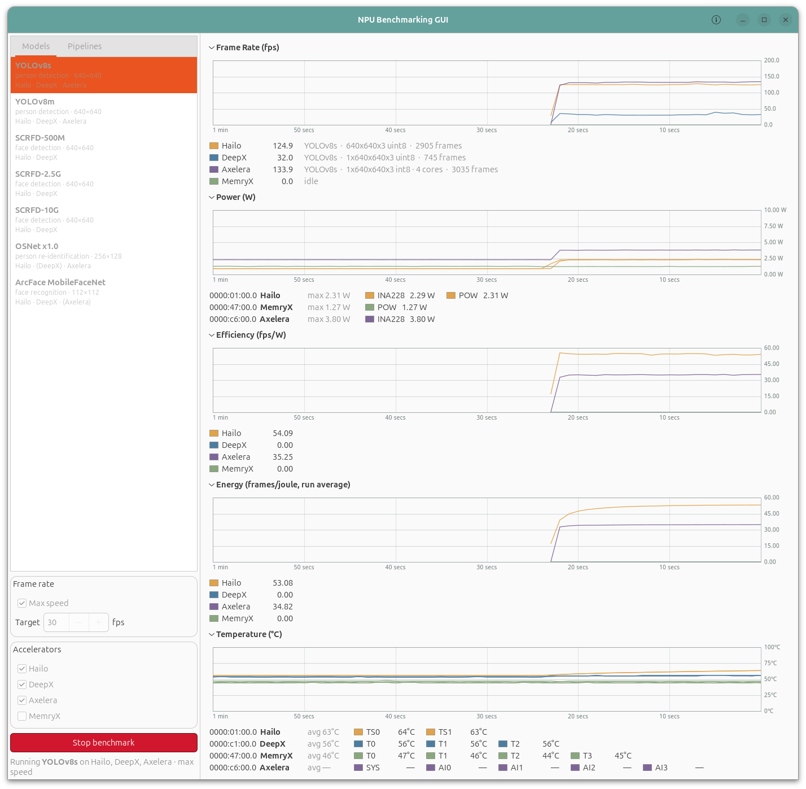

# mb-benchmark-gui

A C++ / GTK4 (gtkmm) desktop GUI that **benchmarks edge-AI NPUs** and charts what
they achieve: frame rate, power, and the two efficiency figures that matter when
comparing accelerators — **fps per watt** and **joules per frame**.

It is the benchmarking companion to [`mb-powermon-gui`](../mb-powermon-gui),
which monitors the same cards' power and temperature. This one adds the load:
it links each vendor's runtime directly and drives inference itself, so the
frame rate on the graph and the watts underneath it come from the same moment on
the same card.



## What it does

Pick a **model** or a **multi-inference pipeline** from the left panel, tick the
accelerators to run it on, choose a target frame rate (or max speed), and press
Start. One worker thread per card loops inference on its own device; the graphs
update once a second.

Five stacked graphs, each a scrolling 60-second window:

| Graph | What it shows |
| ----- | ------------- |
| **Power (W)** | Live draw per card — on-die sensors and external INA228 shunts. |
| **Temperature (°C)** | Per-sensor die temperatures. |
| **Frame Rate (fps)** | Achieved rate per card, plus the model, its input geometry and a running frame count. An idle card sits at 0. |
| **Efficiency (fps/W)** | *Instantaneous*: this second's frame rate divided by this second's watts. |
| **Energy (mJ/frame)** | This second's watts divided by this second's frame rate — the raw energy cost of a frame. **Lower is better** — the only graph here where that is true. Collapsed by default. |

Power and temperature come first because they are live whether or not a
benchmark is running; the three below them only mean anything during a run.

**The graphs are never cleared.** Starting or stopping a run does not wipe the
traces, so consecutive runs stay on one axis and can be read against each other
— change the model or the API mode and the step is visible in place. Idle
stretches sit at zero on all three benchmark graphs. The window is still the
rolling 60 s all the graphs share.

`fps/W` and `mJ/frame` are now both raw per-sample figures, which makes them
**exact reciprocals** — the same measurement in two units, not two different
readings. Keep whichever you think in; Energy ships collapsed since Efficiency
already carries the information. Energy is shown in **milli**joules because at
these rates a frame costs on the order of 1–30 mJ, and plain joules would render
as `0.00`.

An idle card reads 0 mJ/frame. On a lower-is-better axis that could be misread
as perfect efficiency — it means "not running", and the frame rate beside it is
0 too.

Every graph uses **one color per card**, the same color throughout, so a trace on
the frame-rate graph and its trace on the power graph are visibly the same
device.

## Supported accelerators

| Card | Sync inference | Async inference | Power | Temperature |
| ---- | -------------- | --------------- | ----- | ----------- |
| **Hailo-8** | `InferVStreams::infer()` | `InferModel::run_async()` | firmware `POW` + INA228 | `TS0` / `TS1` |
| **DeepX M1** | `InferenceEngine::Run()` | `RunAsync()` / `Wait()` | — (none exposed) | `T0`–`T2` |
| **Axelera Metis** | `axr_run_model_instance()` | **none** — `double_buffer` only | INA228 | `SYS` / `AI0`–`AI3` (needs a live collector) |
| **MemryX MX3** | **none** — 1 frame in flight | `connect_stream()` | MemryX SDK | `T0`–`T3` |

Each backend is **optional and auto-detected at build time**. A card whose SDK is
absent still appears in the UI, greyed out with the reason, and its telemetry
still graphs — the build works on any host.

## Sync API vs Async API

The **Inference API** control switches every backend between a vendor's blocking
call and its asynchronous/streaming one. This is the single biggest lever on the
numbers — far bigger than the model choice — so it is worth understanding what
each mode actually drives.

The four SDKs are **not symmetric**, and the UI does not pretend otherwise. In
each mode exactly one vendor has no native equivalent and is emulated; the
status line under the Start button names that card and how, e.g.
`Axelera: double-buffered · no async API`.

**Async is the default**, because it is what the hardware can actually do.

- **Sync** — one frame at a time, waiting for each. What a latency-bound
  real-time pipeline does. Native on Hailo, DeepX and Axelera. MemryX has no
  blocking call at all, so it is emulated by holding exactly one frame in flight.
- **Async** — several frames outstanding. Peak throughput. Native on Hailo
  (`run_async` + `AsyncInferJob`), DeepX (`RunAsync`/`Wait`, 4 jobs deep) and
  MemryX (`connect_stream`, 4 deep). Axelera's runtime exposes **no async
  inference API whatsoever** — 38 `axr_*` entry points, exactly one of which is
  inference, and it blocks — so "async" there means enabling the runtime's own
  `double_buffer` property, which is a much weaker mechanism.

Measured on this host, max speed:

| YOLOv8s | Sync | Async | |
| ------- | ---: | ----: | --- |
| Hailo-8 | 123.0 | **490.7** | 4.0× |
| DeepX M1 | 32.2 | **148.1** | 4.6× |
| Axelera Metis | 131.2 | 154.3 | 1.2× *(double-buffered)* |

| ResNet-50 | Sync | Async | |
| --------- | ---: | ----: | --- |
| Hailo-8 | 297.3 | **1370.1** | 4.6× |
| DeepX M1 | 392.9 | **1086.7** | 2.8× |
| Axelera Metis | 352.1 | 376.1 | 1.1× *(double-buffered)* |

Two things worth drawing out. DeepX's poor *sync* YOLOv8s figure is an artifact
of the mode, not the card — DXRT is built around its job queue, and in async it
gains 4.6×. And Axelera's small gain is the honest consequence of its API: a
double buffer is not a job queue, and no amount of host threading would make it
one.

**Compare within a mode, never across.** A sync number and an async number are
answers to different questions.

## Models and pipelines

The catalog is **[`config/models.conf`](config/models.conf)** — that file *is*
the Models and Pipelines lists. Adding a model is an edit there, not a rebuild.
Its contents mirror [`envic_ai_cpp`](../envic_ai_cpp)'s pipeline registry, minus
the DeGirum widerface YOLOv8n face detectors, and its download sources are
lifted from the vendor scripts in the sibling project
(`get_hailo8_models.sh`, `get_deepx_models.sh`, `get_axelera_models.sh`).

Entries are **logical** — one row resolves to a different compiled artifact per
vendor (`yolov8s.hef` / `YoloV8S.dxnn` / `yolov8s-coco-onnx`), which is what lets
the same model run on three cards at once and be compared trace against trace.

### Automatic download

Missing artifacts are fetched on first launch into

```
models/<vendor>/<accelerator>/
  hailo/hailo-8      axelera/metis      deepx/dx-m1      memryx/mx3
```

resolved relative to the binary, so the working directory doesn't matter. It runs
on a background thread — the window opens immediately and each row becomes
selectable the moment its artifact lands; until then the card shows in
parentheses, e.g. `Hailo · (DeepX) · Axelera`. Downloads land in a `.part`
sibling and are renamed on success, so an interrupted fetch never leaves a
truncated file that looks like a valid model.

Each vendor's archives have a different shape, so `fetch` in the config says
which to expect:

| `fetch` | Vendor | Shape |
| ------- | ------ | ----- |
| `file` | Hailo, DeepX | `GET <url>/<artifact>`, saved as-is |
| `zip` | Axelera | `GET <url>/<artifact>.zip`, whose `strip` subtree is flattened into a directory named `<artifact>` |
| `zipfile` | MemryX | `GET <url>/<stem>.zip`, from which only the `<artifact>` member is taken |

MemryX archives also carry a `<name>_post.onnx|tflite` head for host-side YOLO
decode; it is deliberately **not** extracted, since no backend runs
post-processing inside the timed loop.

**The first run pulls roughly 1.5 GB** — the Axelera prebuilt zips dominate
(564 MB for `yolov8s-coco-onnx` alone, extracting to ~113 MB). Set
`MB_BENCH_NO_DOWNLOAD=1` to skip fetching entirely and use only what's on disk.
Needs `wget`, plus `unzip` for the Axelera and MemryX archives.

Two artifacts have **no public source** and are marked `source = local` in the
config; they are never fetched, and are used only if you drop them in yourself:

| Artifact | Why |
| -------- | --- |
| `deepx/dx-m1/osnet.dxnn` | Not in the DeepX ModelZoo — compiled locally with DX-COM (see `ai_deepx/models/osnet/deploy.sh` in the sibling project). Without it, DeepX has no People Tracking pipeline. |
| `axelera/metis/arcface_mobilefacenet--112x112_quant_axelera_metis_1` | The Voyager prebuilt catalog ships `facenet-lfw-onnx`, not ArcFace; this is a custom Voyager compile. |

**Models**

| Model | Task | Hailo | DeepX | Axelera | MemryX |
| ----- | ---- | :---: | :---: | :-----: | :----: |
| YOLOv8s / YOLOv8m | person detection, 640×640 | ✅ | ✅ | ✅ | ✅ |
| SCRFD-500M / 2.5G / 10G | face detection, 640×640 | ✅ | ✅ | — | — |
| OSNet x1.0 | person re-identification, 256×128 | ✅ | local | ✅ | — |
| ArcFace MobileFaceNet | face recognition, 112×112 | ✅ | ✅ | local | — |
| ResNet-50 | image classification, 224×224 | ✅ | ✅ | ✅ | ✅ |

(✅ = downloaded automatically; *local* = no public source, see below.)

**Pipelines** — every stage runs once per benchmark frame, in order, on the same
card:

- **People Tracking** — person detection + OSNet ReID (YOLOv8s or YOLOv8m)
- **Face Recognition** — face detection + ArcFace (SCRFD-500M, 2.5G or 10G)

A row with no artifact configured for a vendor simply isn't offered there; a
pipeline is offered only where *every* stage resolves. Nothing here is fatal —
the lists show what you actually have.

## What is being measured

This matters for reading the numbers honestly.

- **Synthetic input, no host pipeline.** There is no camera, no decode, no
  letterbox, no NMS, no drawing. Each stage gets a fixed pseudo-random buffer of
  the model's native input size, prepared once at load. What is timed is the
  accelerator plus its SDK's inference call — not this host's CPU.
- **No host-side conversion in the loop.** Hailo output vstreams are created with
  `HAILO_FORMAT_TYPE_AUTO` (device-native) rather than FLOAT32, so HailoRT does
  not dequantize on the host inside `infer()`. DeepX outputs stay in the
  engine-owned buffers. Axelera outputs are left in their raw padded device
  layout. All three would otherwise be measuring this CPU.
- **One mode at a time, and one call means one frame.** Whichever API mode is
  selected applies to every card in the run, and an async runner tops its
  pipeline up and then blocks until a frame *completes* — so the engine's frame
  counter means the same thing in both modes. See
  [Sync API vs Async API](#sync-api-vs-async-api) for which vendor is emulated
  in which mode; compare within a mode, never across.
- **Pipeline stages run once per frame.** In a real cascade a recognizer runs
  once per *detected object*; a synthetic benchmark has no detections, so each
  stage counts once. (`BenchMember::reps` exists to lift this without a
  redesign.)
- **One subject per card at a time.** Two models sharing a card would split its
  throughput *and* its watts, and neither efficiency figure would mean anything
  per model. The UI enforces one selection at a time.
- **No watts, no efficiency.** A card with no power sensor (DeepX here) reports a
  real frame rate but sits at 0 on both efficiency graphs, rather than being
  given an invented number.
- **Async depth is 4** on DeepX and MemryX, and whatever HailoRT reports as its
  async queue size (capped at 8) on Hailo — deep enough to keep the NPU fed,
  shallow enough that the figure stays a throughput measurement rather than a
  latency-hiding contest.
- **Axelera core allocation.** The card's sub-devices are split evenly across a
  pipeline's stages (a single model gets them all), falling back to one core per
  stage if a model's deploy-time core cap refuses the wider connection. The
  legend shows what it got.

## How it compares to the vendors' own benchmark tools

ResNet-50, Async mode, steady state, measured on this host — against each
vendor's utility run on the *same* machine where possible:

| Card | Vendor tool | Vendor fps | This app | Ratio |
| ---- | ----------- | ---------: | -------: | ----: |
| **Hailo-8** | `hailortcli benchmark` | 1371.3 | **1372.3** | 100 % |
| **DeepX M1** | `dxbenchmark` | ~1009–1070 | **1080.3** | ~101–107 % |
| **MemryX MX3** | `mx_bench -f 50000` | 1795.9 | **1115.8** | 62 % |
| **Axelera Metis** | `inference.py … --aipu-cores 4` (4 streams) | 2054 | **380.3** | 18 % |

Hailo and DeepX land at parity, which is the result that matters most: it says
the async path, the frame accounting and the "one call retires one frame"
contract are all sound. The two shortfalls are both understood, and both are
concurrency, not the device:

- **Axelera — 18 %.** The vendor figure comes from the Voyager *pipeline*
  running **four parallel video streams** with OpenCL preprocessing across 4
  AIPU cores. This app issues a single blocking `axr_run_model_instance` on one
  model instance. Since libaxruntime exposes no async inference API at all, the
  only way to express that concurrency is N model instances driven from N host
  threads — which this app does not (yet) do. Note the comparison is unfair *in
  our favour* on scope — their 2054 fps is end-to-end including video decode,
  ours is inference-only — so the whole gap is parallelism.
- **MemryX — 62 %.** One stream with 4 frames in flight, where `mx_bench`
  drives more. Corroborated by the power: 7.6 W against the vendor run's 11.0 W,
  i.e. the device is not being saturated. More `connect_stream` ids and/or
  `set_num_workers` should close it.

Efficiency, same runs:

| Card | This app | Vendor run |
| ---- | -------: | ---------: |
| Hailo-8 | 304.6 fps/W @ 4.50 W | 343 fps/W @ 4.0 W |
| MemryX MX3 | 146.2 fps/W @ 7.63 W | 163 fps/W @ 11.0 W |
| Axelera Metis | 104.0 fps/W @ 3.66 W | 270 fps/W @ 7.6 W |
| DeepX M1 | — (no power sensor) | 214 fps/W @ 4.7 W |

Efficiency figures are only comparable at comparable *load* — a card that is
being under-driven draws less power but also does proportionally less work, and
the fixed overhead (PCIe, LPDDR) is then amortised over fewer frames. That is
why Axelera's fps/W looks far worse here than in the vendor run: it is idling
between frames, not being inefficient.

## Build

```bash
cmake -S . -B build -DCMAKE_BUILD_TYPE=Release && cmake --build build -j
./build/mb-benchmark          # needs a display (X11/Wayland)
```

Requires `gtkmm-4.0`. Everything else is optional and reported at configure time:

```
-- Hailo-8 backend:   ENABLED (/usr/local/lib/libhailort.so)
-- DeepX M1 backend:  ENABLED (/usr/local/lib/libdxrt.so)
-- Axelera backend:   ENABLED (/opt/axelera/runtime-1.7.0-1/lib/libaxruntime.so)
-- MemryX MX3 backend: ENABLED (/usr/lib/x86_64-linux-gnu/libmx_accl.so)
-- INA228 power:      ENABLED (libftdi1 1.5)
```

- **HailoRT** — `libhailort` + `/usr/local/include/hailo` (no pkg-config/CMake
  package, found via `find_library`/`find_path`).
- **DXRT** — installed system-wide; ships a CMake package (`find_package(dxrt)`).
- **libaxruntime** — auto-detected under `/opt/axelera/runtime-*`; override with
  `-DAXELERA_DIR=<dir>` (must contain `include/axruntime/axruntime.h` and
  `lib/libaxruntime.so`).
- **memx-accl** — the MemryX runtime. Link **`libmx_accl`**, not `libmemx`:
  the latter is the *driver* library and carries none of the `MxAccl` symbols.
  Headers at `/usr/include/memx/accl/`.
- **libftdi1** — the **1.x** dev package (`apt install libftdi1-dev`), for INA228
  external power. Without it the efficiency graphs stay at 0 for any card with no
  on-die power sensor.

Axelera JIT-compiles each model's `kernel_function.c` with
`riscv64-unknown-elf-gcc` at model load, and that compiler is not on a default
`PATH`. **The app finds it for you** — it looks under `/opt/axelera/*/bin` at
startup and prepends it — so no wrapper script is needed. If your toolchain
lives elsewhere, point `MB_AXELERA_TOOLCHAIN` at the directory containing the
compiler.

Without it, the runtime fails every Axelera model with
`Failed to create executor for model: kernel_function`, which names the model
rather than the missing compiler; the app appends the real explanation to that
message.

## Configuration

**Model catalog.** [`config/models.conf`](config/models.conf) — vendor download
sources, the model list, and the pipeline definitions. Override its location
with `$MB_BENCH_MODELS_CONFIG`; override where artifacts are stored with
`$MB_BENCH_MODELS_ROOT` (default `<repo>/models`). Both resolved paths are
logged at startup.

**INA228 labels.** The app's config lives in [`config/`](config/), versioned
alongside the source. [`config/ina228.conf`](config/ina228.conf) maps each
FT232H bridge's USB port-path to the accelerator whose rail it measures:

```ini
1-1 = Hailo
1-2 = Axelera
```

Naming an accelerator exactly (`Hailo`, `DeepX`, `Axelera`, `MemryX`) folds that
shunt onto the card's legend row, gives it the card's color, and feeds its fps/W
and mJ/frame figures. An unmapped bridge gets a standalone `INA228#<n>` row
and feeds nothing. Search order:

1. `$MB_INA228_CONFIG`
2. `<repo>/config/ina228.conf` — resolved relative to the binary, so it works
   from any working directory
3. `$XDG_CONFIG_HOME/mb-benchmark-gui/ina228.conf` (else `~/.config/…`)

## Known issues

### Fixed — kept here because the symptoms are misleading

If you see one of these again, this is what it means:

- **`Gtk-CRITICAL … gtk_list_box_get_selected_row: assertion 'GTK_IS_LIST_BOX
  (box)' failed`, then `Segmentation fault` on exit.** GTK widget members are
  destroyed in *reverse* declaration order, so the two `Gtk::ListBox`es died
  before the `Gtk::Notebook` that outlives them; tearing the notebook down then
  emitted `switch_page`, whose handler read the already-destroyed list box.
  Fixed by severing every widget-signal connection in `~ControlPanel` — the
  destructor body is the last moment at which all the widgets are still alive —
  and by disconnecting the 1 Hz tick in `~MainWindow` so it cannot fire into a
  window that is coming apart.
- **`BrokenPipeError: [Errno 32] Broken pipe` traceback on exit.** Cosmetic, and
  not from the app itself: the MemryX power helper is a small Python subprocess,
  and when the app exits its stdout pipe closes mid-write. Python printed the
  traceback to the stderr it inherited — your terminal. The helper now exits via
  `os._exit(0)` on a write failure, which skips both the traceback and the
  interpreter's shutdown flush.

- **`corrupted double-linked list`, intermittently, in Async mode.** Not heap
  corruption in the usual sense: HailoRT ran a completion callback on its own
  worker thread after the per-model state it writes into had been destroyed.
  Detached async jobs are still in flight at teardown unless you wait for them.
  Reproduced on every YOLOv8s run and *never* on ResNet-50 — the fast model
  drained before teardown, which made it look model-specific when it was purely
  a race. Fixed by draining in-flight jobs and tearing down the configured model
  before the slot bookkeeping.
- **`[HailoRT] [warning] read_async() was provided an unaligned buffer`.** Buffers
  handed to HailoRT must be page-**aligned** *and* page-**rounded**; a plain
  `std::vector` is neither. Beyond the performance note in the warning,
  `infer_model.hpp` warns that an under-sized *output* allocation risks memory
  corruption past the last page. Fixed with a page-aligned allocator.
- **`Failed to create executor for model: kernel_function` on every Axelera
  model.** Reads like a bad model; it is a missing compiler. The Voyager runtime
  JIT-compiles each model's `kernel_function.c` with `riscv64-unknown-elf-gcc`,
  which is not on a default `PATH`. The app now locates the toolchain itself.
- **All Axelera models silently skipped at download time.** The tool-presence
  probe ran `unzip --version` — not a valid invocation, so unzip printed its
  usage and exited non-zero, and the fetcher concluded unzip was missing. Now the
  test is whether the binary can be *started*, not its exit status.
- **A graph section that would not grow when expanded.** `vexpand` was sampled
  once at construction, so a section that started collapsed could never share
  vertical space, and one that started expanded kept claiming it after being
  collapsed. Now bound to the expanded state.
- **An accelerator checkbox staying off after switching models.** Cards are
  unticked when the selected model has no build for them; the user's intent is
  now remembered separately and restored when a model that supports the card is
  selected again.

## Notes

- Only one process can hold a Hailo device's power measurement at a time.
  Running `mb-powermon` / `mb-powermon-gui` alongside this will fail one of them
  with `DVM_ALREADY_IN_USE` — stop one.
- Axelera temperatures only appear once a Metis app has loaded the card's
  firmware *and* something is running its collector; a benchmark on the Metis
  does the first but not the second. See `mb-powermon-gui`'s README for the full
  recovery recipe.
- Kill stray instances with `pkill -x mb-benchmark` (exact name) — `pkill -f
  build/mb-benchmark` also matches your own shell command.
